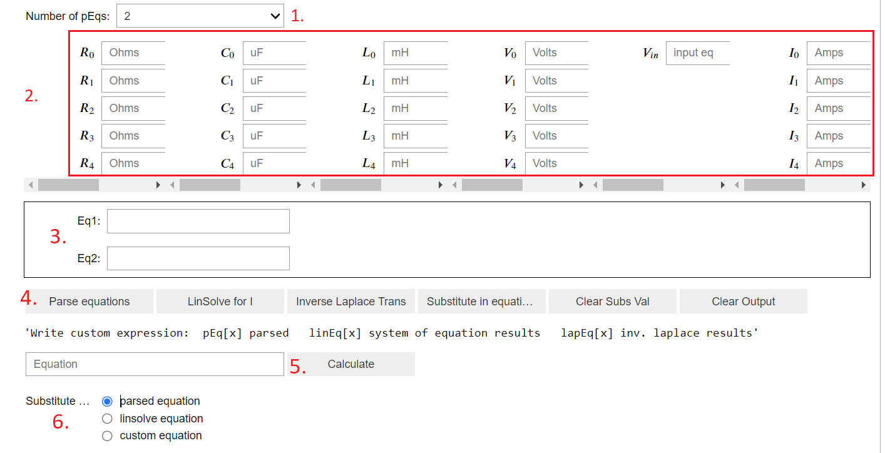
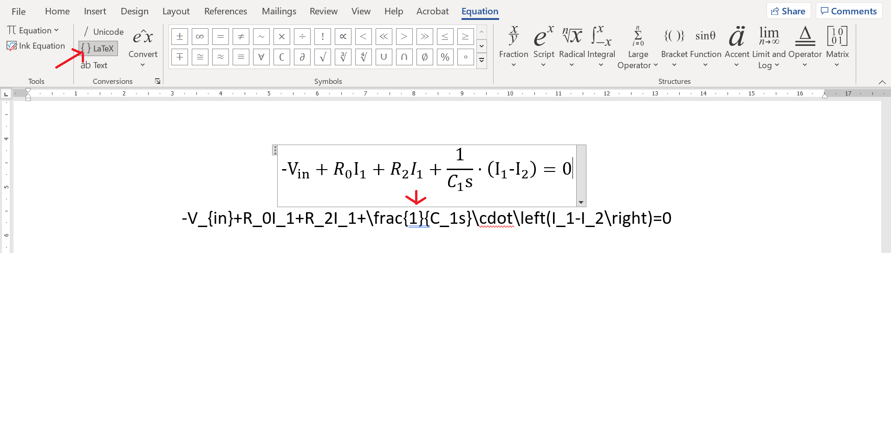

# LinCircuit-equation-solver
A jupyter notebook based Linear circuit equation solver and calculator. Used to symbolically analize linear circuits, especially in the complex frequency - s domain, but can also be used as a neat linear equation solver and substituter.

The needed libraries are: sympy and ipywidgets, which come by default when installing Anaconda.

Download [Anaconda for windows](https://www.anaconda.com/products/individual)

⠀

## Description
1. Choose the number of equations you want to solve
2. You can write values or sympy expressions to substitute into the equations
3. Write your equations as LaTeX here
4. Buttons
    * Parse equations - read(parse) the equations form section 3.
    * LinSolve for I - solve the system of equations for current I
    * Inverse laplace trans - Inverse laplace transform the resulting linsolve equations
    * Substitute in equations - substitute the values from section 2. into equations
    * Clear subs values - currently doesn't work
    * Clear Output - clears the outputed equations
5. You can write custom expressions.
    * For example if i want to add 2 to the first parsed equation I would enter: pEq[0] + 2.
    * I can also multiply the second parsed equation by 2: pEq[1] * 2.
    * I can multiply the first parsed equation with the second linsolve equation: pEq[0] * linEq[1]
6. Select into which equations you want to substitute values.

## Getting LaTeX equations form Microsoft Word
If you write your equations in Word you can directly copy them into this calculator. Just make sure you have selected the LaTex equation type in the Equation tab in Word.

